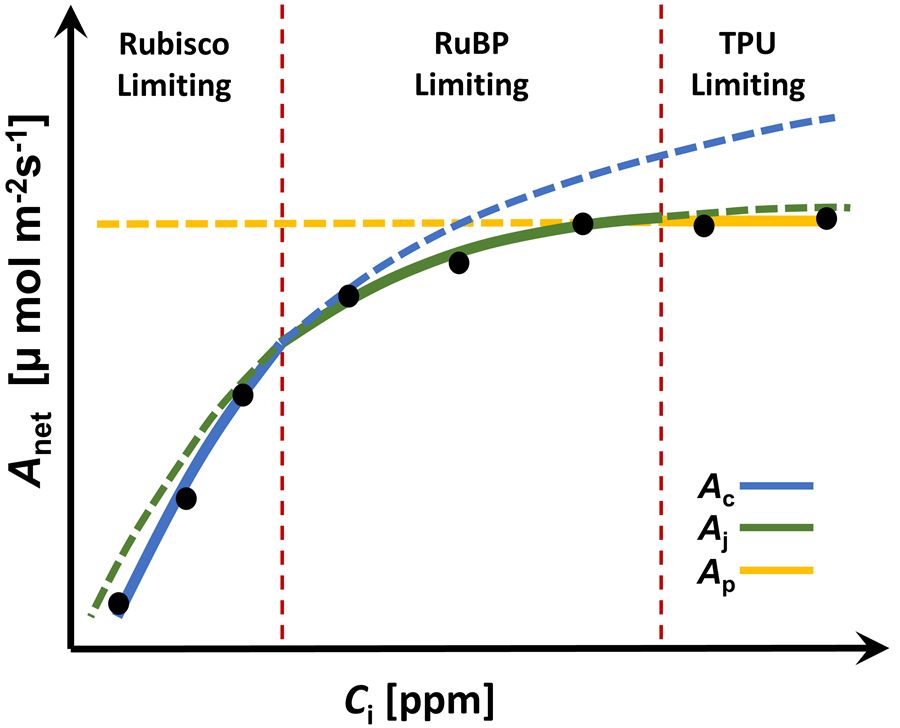
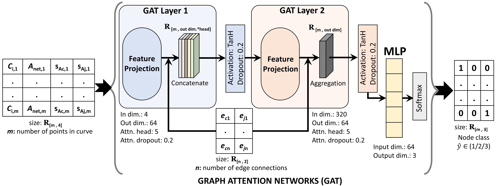

# SEAGAN Examples With Training And Testing Data

This repository is a friendly companion to the `seagan` PyPI package. It keeps
the real Excel data used for training and testing, plus small Python examples
that show how to use SEAGAN without rebuilding the notebook from scratch.

SEAGAN is an edge-aware Graph Attention Network for node classification on A-Ci
curve graphs. Each curve is treated as a graph so the model can learn from the
shape of the A-Ci response, the relationship between nearby curve points, and
process-aware features derived from photosynthesis equations.

## Problem description

An A-Ci curve measures how net photosynthesis, `Anet`, changes as intercellular
CO2 concentration, `Ci`, changes. In C3 photosynthesis, different parts of the
curve are controlled by different biochemical limits:



- At low `Ci`, photosynthesis is usually **Rubisco limited**.
- In the middle region, the curve is often **RuBP regeneration limited**.
- At high `Ci`, the response can become **TPU limited**, where photosynthesis
  starts to flatten.

The black dots in the figure represent measured A-Ci points. The colored curves
show the candidate biochemical rates: `Ac`, `Aj`, and `Ap`. The red dashed lines
mark the transition regions where the active limitation changes.

The difficult part is that real measured points do not come with labels saying
"this point is Rubisco limited" or "this point is TPU limited." Near the
transition boundaries, even small noise in the curve can make the active
limitation hard to identify by eye or with simple rules.

That is the classification problem SEAGAN solves: for every point on an A-Ci
curve, predict which biochemical process is limiting photosynthesis.

Instead of treating points independently, SEAGAN treats the whole A-Ci curve as
a graph. Each measured point becomes a node, nearby points become graph edges,
and the model uses both curve shape and process-aware edge information to make
point-level limitation-state predictions.



## What Is Inside

- `Data/Train/ACi_points.xlsx`: all training curve points in one file.
- `Data/Train/ACi_params.xlsx`: all training curve parameters in one file.
- `Data/Test/ACi_points.xlsx`: all testing curve points in one file.
- `Data/Test/ACi_params.xlsx`: all testing curve parameters in one file.
- `GNN_FC_GAT_Focal.ipynb`: the original notebook workflow.
- `examples/pretrained_inference.py`: use the pretrained model from
  `pip install seagan` on one selected test curve.
- `examples/train_and_test.py`: train a fresh SEAGAN model and evaluate it on
  the test folder.

## Install

```powershell
python -m pip install -r requirements.txt
```

or directly:

```powershell
python -m pip install seagan
```

## The Model Idea

The SEAGAN package builds one graph per A-Ci curve:

| Part | Meaning |
| --- | --- |
| Node features | `Ci`, `Anet`, computed `Ac`, computed `Aj` |
| Graph edges | k-nearest neighbors in `[Ci, Anet]` space |
| Edge features | pairwise differences `[dAc, dAj]` |
| Model | edge-aware GAT layers followed by a small classifier |
| Task | classify each curve point into one of 3 limitation states |

The default example model follows the PyPI package setup: input dimension `4`,
hidden sizes `[64, 64]`, `5` attention heads, dropout `0.2`, edge dimension `2`,
and `3` node classes.

## Use The Pretrained Model

Open [examples/pretrained_inference.py](examples/pretrained_inference.py) and
change the settings near the top:

```python
DATA_SPLIT = "Test"
CURVE_ID_TO_CHECK = 101
CURVE_NUMBER_TO_CHECK = 0
```

Then run:

```powershell
python examples/pretrained_inference.py
```

You can also choose the curve from the command line:

```powershell
python examples/pretrained_inference.py --curve-id 101
python examples/pretrained_inference.py --curve-number 5
```

`--curve-id` means the actual `curve_id` value in the Excel file. `--curve-number`
means the zero-based position of the curve in the selected split.

## Train And Test A New Model

Open [examples/train_and_test.py](examples/train_and_test.py) and edit the
human-readable settings near the top:

```python
EPOCHS = 30
BATCH_SIZE = 128
LEARNING_RATE = 1e-3
HIDDEN_SIZES = [64, 64]
ATTENTION_HEADS = 5
CHECKPOINT_TO_SAVE = Path("outputs") / "seagan_example_checkpoint.pt"
```

For a quick check:

```powershell
python examples/train_and_test.py --epochs 1
```

For a real notebook-like run:

```powershell
python examples/train_and_test.py --epochs 800
```

The script trains on `Data/Train`, uses part of those graphs for validation, and
then evaluates once on `Data/Test`. The saved checkpoint includes the model
weights, class map, standardization statistics, training settings, and final
metrics.

Class weights are still used in the focal loss during training, matching the
notebook idea of reducing bias from imbalanced node counts. The reported
evaluation metrics are different on purpose: the script scores class 1, class 2,
and class 3 separately, then averages the three values without applying class
weights. This keeps the largest class from dominating F1, recall, precision, and
the other reported results.

## Data Format

The point files should contain one row per point in a curve:

| Column | Meaning |
| --- | --- |
| `curve_id` | curve identifier |
| `point_id` | point number inside that curve |
| `Ci` | intercellular CO2 concentration |
| `Anet` | net assimilation |
| `ID` | true node class label, usually `1`, `2`, or `3` |

The parameter files should contain one row per curve:

| Column | Meaning |
| --- | --- |
| `curve_id` | curve identifier |
| `Tleaf` | leaf temperature in Celsius |

SEAGAN only needs `curve_id` and `Tleaf` for graph construction.

## Citation

This code is released under an MIT-style license, but please cite the SEAGAN
work if you use it in a paper, thesis, package, report, or public project.

```bibtex
@misc{srivastava2026seagan,
  title = {SEAGAN: domain-Specific and Edge-Aware Graph Attention Network for Dynamic Plant Processes},
  author = {Srivastava, Antriksh and Kar, Soumyashree},
  year = {2026},
  eprint = {2606.19623},
  archivePrefix = {arXiv},
  primaryClass = {cs.LG},
  url = {https://arxiv.org/abs/2606.19623}
}
```

See [CITATION.cff](CITATION.cff) for citation metadata.

## License

See [LICENSE](LICENSE). In short: you can use, modify, and share this code under
the MIT License. Citation is not a replacement for the license, but it is the
expected scholarly practice when this work helps your research or software.
